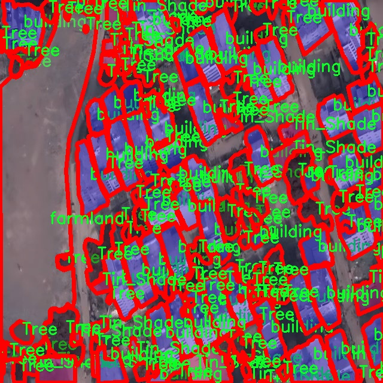
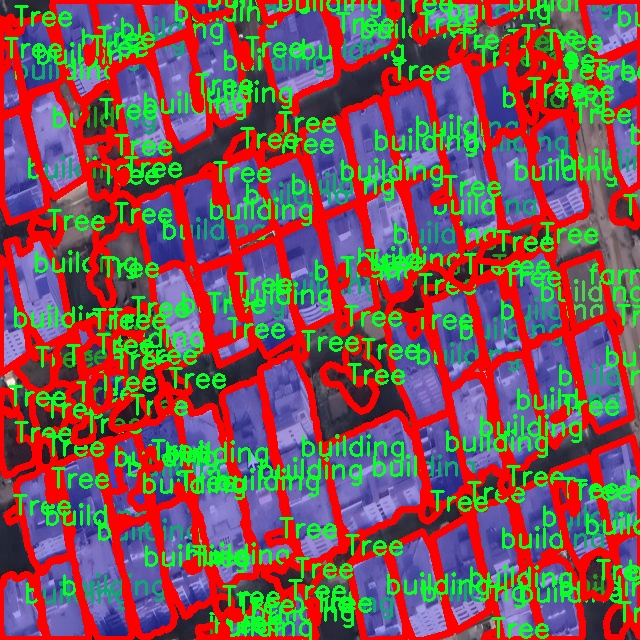
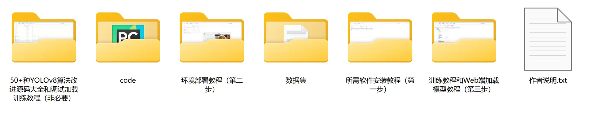

# 航拍遥感场景图像分割系统： yolov8-seg-RCSOSA

### 1.研究背景与意义

[参考博客](https://gitee.com/YOLOv8_YOLOv11_Segmentation_Studio/projects)

[博客来源](https://kdocs.cn/l/cszuIiCKVNis)

研究背景与意义

随着遥感技术的迅速发展，航拍图像在环境监测、城市规划、农业管理等领域的应用日益广泛。尤其是在全球气候变化和生态环境保护的背景下，精准的土地利用和覆盖类型识别显得尤为重要。传统的图像处理方法在复杂场景下的表现往往受到限制，无法满足高精度、高效率的需求。因此，基于深度学习的图像分割技术逐渐成为研究的热点，其中YOLO（You Only Look Once）系列模型因其优越的实时性和准确性而备受关注。

YOLOv8作为YOLO系列的最新版本，结合了更为先进的网络结构和优化算法，能够在多种场景下实现高效的目标检测与分割。然而，针对航拍遥感图像的特定需求，YOLOv8的标准模型可能无法充分发挥其潜力。为了提升航拍遥感场景下的图像分割效果，针对特定数据集进行模型改进和优化显得尤为重要。

本研究选取了“Deforestation-Satellite-Imagery”数据集，该数据集包含1100幅图像，涵盖了五个主要类别：Tin_Shade、Tree、Building、Farmland和Water。这些类别不仅反映了地表覆盖的多样性，也为模型的训练和评估提供了丰富的样本。通过对这些类别的深入分析，可以发现，树木和建筑物的分割精度直接影响到生态监测和城市管理的效果，而农田和水体的识别则对农业发展和水资源管理具有重要意义。因此，基于改进YOLOv8的图像分割系统的研究，能够为这些领域提供更为精准的数据支持。

在技术层面，改进YOLOv8的航拍遥感图像分割系统将采用多种策略，包括数据增强、模型结构优化和损失函数调整等，以提高模型在复杂背景下的分割能力。此外，结合实例分割的思想，可以更好地处理同类目标的重叠问题，提升分割的精细度和准确性。这不仅能够提高模型在实际应用中的表现，也为后续的研究提供了新的思路和方法。

从社会意义上看，精准的航拍遥感图像分割系统将为环境保护、资源管理和城市规划等领域提供重要的决策支持。通过对森林砍伐、城市扩张和农业用地变化的实时监测，相关部门能够及时采取措施，保护生态环境，实现可持续发展。同时，研究成果也将为遥感图像处理领域的学术研究提供有价值的参考，推动相关技术的进步与应用。

综上所述，基于改进YOLOv8的航拍遥感场景图像分割系统的研究，不仅具有重要的学术价值和应用前景，更为实现生态环境保护和可持续发展目标提供了有力的技术支持。通过对该系统的深入研究，期望能够在遥感图像处理领域开辟出新的研究方向，为未来的相关研究奠定基础。

### 2.图片演示


注意：本项目提供完整的训练源码数据集和训练教程,由于此博客编辑较早,暂不提供权重文件（best.pt）,需要按照6.训练教程进行训练后实现上图效果。

### 3.视频演示

[3.1 视频演示](https://www.bilibili.com/video/BV1KLmyYtE4m/)

### 4.数据集信息

##### 4.1 数据集类别数＆类别名

nc: 5
names: ['Tin_Shade', 'Tree', 'building', 'farmland', 'water']


##### 4.2 数据集信息简介

数据集信息展示

在现代遥感技术的快速发展背景下，针对航拍图像的分析与处理成为了研究的热点之一。本研究所采用的数据集名为“Deforestation-Satellite-Imagery”，其主要目的是为改进YOLOv8-seg模型在航拍遥感场景中的图像分割能力提供支持。该数据集包含了丰富的地理信息，涵盖了五个主要类别，分别是“Tin_Shade”、“Tree”、“building”、“farmland”和“water”。这些类别的选择不仅反映了遥感图像中常见的地物特征，也为我们在进行图像分割时提供了多样化的训练样本。

首先，数据集中“Tin_Shade”类别代表了在遥感图像中常见的金属遮阳结构，这类结构通常出现在城市或乡村的建筑物周围，具有明显的几何形状和光影特征。通过对这一类别的准确分割，模型能够有效识别出遮阳设施的分布情况，为城市规划和环境监测提供重要数据支持。

其次，“Tree”类别是数据集中的一个关键组成部分，涵盖了各种树木的形态特征。树木的分布与生态环境密切相关，尤其是在森林砍伐和土地利用变化的研究中，树木的准确识别与分割至关重要。通过对树木进行精确的图像分割，研究人员能够更好地评估森林覆盖率的变化，进而推动可持续发展和生态保护的相关政策。

“building”类别则涵盖了各类建筑物的特征，这对于城市发展和土地利用研究具有重要意义。建筑物的分布和密度不仅影响城市的形态，还与社会经济活动息息相关。通过对建筑物的有效分割，研究人员可以获取城市化进程中的重要信息，帮助决策者制定更为科学的城市发展规划。

在“farmland”类别中，数据集包含了不同类型的农田图像。这一类别的分析对于农业监测和土地利用变化研究具有重要意义。通过对农田的精确分割，研究人员能够监测作物种植情况、评估农业生产力，并为农业政策的制定提供数据支持。

最后，“water”类别则代表了水体的分布情况，包括河流、湖泊和其他水域。水体的变化不仅影响生态环境，还与气候变化和人类活动密切相关。通过对水体的分割，研究人员能够分析水资源的变化趋势，为水资源管理和保护提供科学依据。

综上所述，“Deforestation-Satellite-Imagery”数据集通过对五个主要类别的精细划分，为改进YOLOv8-seg模型在航拍遥感场景图像分割中的应用提供了丰富的训练数据。这些类别的选择不仅涵盖了自然环境与人类活动的交互关系，也为后续的研究提供了广泛的应用前景。通过深入分析和处理这些数据，研究人员能够更好地理解地表变化的动态过程，为生态保护、城市规划和农业管理等领域提供有力支持。








### 5.项目依赖环境部署教程（零基础手把手教学）

[5.1 环境部署教程链接（零基础手把手教学）](https://www.bilibili.com/video/BV1jG4Ve4E9t/?vd_source=bc9aec86d164b67a7004b996143742dc)


[5.2 安装Python虚拟环境创建和依赖库安装视频教程链接（零基础手把手教学）](https://www.bilibili.com/video/BV1nA4VeYEze/?vd_source=bc9aec86d164b67a7004b996143742dc)

### 6.手把手YOLOV8-seg训练视频教程（零基础手把手教学）

[6.1 手把手YOLOV8-seg训练视频教程（零基础小白有手就能学会）](https://www.bilibili.com/video/BV1cA4VeYETe/?vd_source=bc9aec86d164b67a7004b996143742dc)


按照上面的训练视频教程链接加载项目提供的数据集，运行train.py即可开始训练



     Epoch   gpu_mem       box       obj       cls    labels  img_size
     1/200     0G   0.01576   0.01955  0.007536        22      1280: 100%|██████████| 849/849 [14:42<00:00,  1.04s/it]
               Class     Images     Labels          P          R     mAP@.5 mAP@.5:.95: 100%|██████████| 213/213 [01:14<00:00,  2.87it/s]
                 all       3395      17314      0.994      0.957      0.0957      0.0843

     Epoch   gpu_mem       box       obj       cls    labels  img_size
     2/200     0G   0.01578   0.01923  0.007006        22      1280: 100%|██████████| 849/849 [14:44<00:00,  1.04s/it]
               Class     Images     Labels          P          R     mAP@.5 mAP@.5:.95: 100%|██████████| 213/213 [01:12<00:00,  2.95it/s]
                 all       3395      17314      0.996      0.956      0.0957      0.0845

     Epoch   gpu_mem       box       obj       cls    labels  img_size
     3/200     0G   0.01561    0.0191  0.006895        27      1280: 100%|██████████| 849/849 [10:56<00:00,  1.29it/s]
               Class     Images     Labels          P          R     mAP@.5 mAP@.5:.95: 100%|███████   | 187/213 [00:52<00:00,  4.04it/s]
                 all       3395      17314      0.996      0.957      0.0957      0.0845


### 7.50+种全套YOLOV8-seg创新点加载调参实验视频教程（一键加载写好的改进模型的配置文件）

[7.1 50+种全套YOLOV8-seg创新点加载调参实验视频教程（一键加载写好的改进模型的配置文件）](https://www.bilibili.com/video/BV1Hw4VePEXv/?vd_source=bc9aec86d164b67a7004b996143742dc)

### YOLOV8-seg算法简介

原始YOLOv8-seg算法原理

YOLOv8-seg是YOLO系列模型中的最新版本，推出于2023年1月10日。作为计算机视觉领域的前沿技术，YOLOv8-seg不仅在目标检测上表现卓越，还扩展了实例分割的能力，成为了分类、检测和分割任务的最先进模型。其设计理念源于对YOLOv5、YOLOv6和YOLOX等模型的深入分析与借鉴，综合了这些模型的优点，形成了一个高效、精确且易于使用的框架。

YOLOv8-seg的核心在于其独特的网络结构，包含输入层、主干网络、特征融合层和解耦头。与之前的YOLO版本相比，YOLOv8-seg在多个方面进行了显著的改进，尤其是在骨干网络的设计上。新的骨干网络采用了C2f模块，取代了YOLOv5中的C3模块，C2f模块通过引入ELAN思想，增加了多条跳层连接，极大地改善了梯度流动，缓解了深层网络中的梯度消失问题。这种设计不仅提高了特征提取的效率，还增强了模型对小目标的检测能力。

在特征融合方面，YOLOv8-seg使用了PAN-FPN结构，这一结构通过自下而上的特征融合，充分利用了不同层次的特征信息。具体而言，YOLOv8-seg在上采样阶段去掉了冗余的卷积层，直接将高层特征与中层特征进行拼接，从而实现了信息的高效传递和融合。这种设计使得模型能够更好地捕捉到目标的细节信息和语义信息，从而提升了检测的准确性。

YOLOv8-seg还引入了Anchor-Free的检测头，摒弃了传统的Anchor-Based方法。这一创新使得模型在处理不同尺寸和形状的目标时更加灵活，减少了对预定义锚框的依赖。此外，YOLOv8-seg的解耦头结构将分类和回归任务分开处理，使得每个任务的优化更加专注，进一步提升了模型的性能。

损失函数的设计也是YOLOv8-seg的一大亮点。模型采用了VFLLoss作为分类损失，DFLLoss与CIoULoss的组合用于回归损失。这种多损失函数的设计，能够更好地平衡分类与回归任务的学习，提升了模型在复杂场景下的表现。

在数据预处理方面，YOLOv8-seg延续了YOLOv5的策略，采用了马赛克增强、混合增强、空间扰动和颜色扰动等多种数据增强手段。这些增强技术有效地扩展了训练数据的多样性，提高了模型的泛化能力。

YOLOv8-seg的网络框架通过对输入图像进行640x640的RGB转换，经过一系列的卷积、归一化和激活函数处理，最终生成目标的检测结果。每个特征图的输出都经过解码，转化为真实的边界框格式，从而实现对目标的精确定位。

值得注意的是，YOLOv8-seg在处理小目标时表现尤为突出，这得益于其精细的特征提取和融合能力。通过在不同层次间的特征传递，模型能够有效捕捉到小目标的细节信息，进而提升了检测的准确性。

总的来说，YOLOv8-seg通过一系列创新的设计与改进，构建了一个高效、灵活且精确的目标检测与实例分割框架。其在计算速度和精度上的优越表现，使其成为当前计算机视觉领域的一个重要里程碑。随着YOLOv8-seg的推广与应用，未来在智能监控、自动驾驶、无人机等领域的应用前景将更加广阔。


### 9.系统功能展示（检测对象为举例，实际内容以本项目数据集为准）

图9.1.系统支持检测结果表格显示

  图9.2.系统支持置信度和IOU阈值手动调节

  图9.3.系统支持自定义加载权重文件best.pt(需要你通过步骤5中训练获得)

  图9.4.系统支持摄像头实时识别

  图9.5.系统支持图片识别

  图9.6.系统支持视频识别

  图9.7.系统支持识别结果文件自动保存

  图9.8.系统支持Excel导出检测结果数据


### 10.50+种全套YOLOV8-seg创新点原理讲解（非科班也可以轻松写刊发刊，V11版本正在科研待更新）

#### 10.1 由于篇幅限制，每个创新点的具体原理讲解就不一一展开，具体见下列网址中的创新点对应子项目的技术原理博客网址【Blog】：


[10.1 50+种全套YOLOV8-seg创新点原理讲解链接](https://gitee.com/qunmasj/good)

#### 10.2 部分改进模块原理讲解(完整的改进原理见上图和技术博客链接)【如果此小节的图加载失败可以通过CSDN或者Github搜索该博客的标题访问原始博客，原始博客图片显示正常】
### YOLOv8简介
YOLOv8 尚未发表论文，因此我们无法直接了解其创建过程中进行的直接研究方法和消融研究。话虽如此，我们分析了有关模型的存储库和可用信息，以开始记录 YOLOv8 中的新功能。

如果您想自己查看代码，请查看YOLOv8 存储库并查看此代码差异以了解一些研究是如何完成的。

在这里，我们提供了有影响力的模型更新的快速总结，然后我们将查看模型的评估，这不言自明。

GitHub 用户 RangeKing 制作的下图显示了网络架构的详细可视化。


在这里插入图片描述


在这里插入图片描述

YOLOv8 架构，GitHub 用户 RangeKing 制作的可视化

无锚检测
YOLOv8 是一个无锚模型。这意味着它直接预测对象的中心而不是已知锚框的偏移量。


YOLO中anchor box的可视化

锚框是早期 YOLO 模型中众所周知的棘手部分，因为它们可能代表目标基准框的分布，而不是自定义数据集的分布。


YOLOv8 的检测头，在netron.app中可视化

Anchor free 检测减少了框预测的数量，从而加速了非最大抑制 (NMS)，这是一个复杂的后处理步骤，在推理后筛选候选检测。


YOLOv8 的检测头，在netron.app中可视化

新的卷积
stem 的第一个6x6conv 被替换为 a 3x3，主要构建块被更改，并且C2f替换了C3。该模块总结如下图，其中“f”是特征数，“e”是扩展率，CBS是由a Conv、a BatchNorm、a组成的block SiLU。

在中， （两个具有剩余连接的 3x3C2f的奇特名称）的所有输出都被连接起来。而在仅使用最后一个输出。Bottleneck``convs``C3``Bottleneck


新的 YOLOv8C2f模块

这Bottleneck与 YOLOv5 中的相同，但第一个 conv 的内核大小从更改1x1为3x3. 从这些信息中，我们可以看到 YOLOv8 开始恢复到 2015 年定义的 ResNet 块。

在颈部，特征直接连接而不强制使用相同的通道尺寸。这减少了参数数量和张量的整体大小。

### 空间和通道重建卷积SCConv
参考该博客提出的一种高效的卷积模块，称为SCConv (spatial and channel reconstruction convolution)，以减少冗余计算并促进代表性特征的学习。提出的SCConv由空间重构单元(SRU)和信道重构单元(CRU)两个单元组成。

（1）SRU根据权重分离冗余特征并进行重构，以抑制空间维度上的冗余，增强特征的表征。

（2）CRU采用分裂变换和融合策略来减少信道维度的冗余以及计算成本和存储。

（3）SCConv是一种即插即用的架构单元，可直接用于替代各种卷积神经网络中的标准卷积。实验结果表明，scconvo嵌入模型能够通过减少冗余特征来获得更好的性能，并且显著降低了复杂度和计算成本。


SCConv如图所示，它由两个单元组成，空间重建单元(SRU)和通道重建单元(CRU)，以顺序的方式放置。具体而言，对于瓶颈残差块中的中间输入特征X，首先通过SRU运算获得空间细化特征Xw，然后利用CRU运算获得信道细化特征Y。SCConv模块充分利用了特征之间的空间冗余和通道冗余，可以无缝集成到任何CNN架构中，以减少中间特征映射之间的冗余并增强CNN的特征表示。

#### SRU单元用于空间冗余


为了利用特征的空间冗余，引入了空间重构单元(SRU)，如图2所示，它利用了分离和重构操作。

分离操作 的目的是将信息丰富的特征图与空间内容对应的信息较少的特征图分离开来。我们利用组归一化(GN)层中的比例因子来评估不同特征图的信息内容。具体来说，给定一个中间特征映射X∈R N×C×H×W，首先通过减去平均值µ并除以标准差σ来标准化输入特征X，如下所示:


其中µ和σ是X的均值和标准差，ε是为了除法稳定性而加入的一个小的正常数，γ和β是可训练的仿射变换。

GN层中的可训练参数\gamma \in R^{C}用于测量每个批次和通道的空间像素方差。更丰富的空间信息反映了空间像素的更多变化，从而导致更大的γ。归一化相关权重W_{\gamma} \in R^{C}由下面公式2得到，表示不同特征映射的重要性。


然后将经Wγ重新加权的特征映射的权值通过sigmoid函数映射到(0,1)范围，并通过阈值进行门控。我们将阈值以上的权重设置为1，得到信息权重W1，将其设置为0，得到非信息权重W2(实验中阈值设置为0.5)。获取W的整个过程可以用公式表示。


最后将输入特征X分别乘以W1和W2，得到两个加权特征:信息量较大的特征X_{1}^{\omega }和信息量较小的特征X_{2}^{\omega }。这样就成功地将输入特征分为两部分:X_{1}^{\omega }具有信息量和表达性的空间内容，而X_{2}^{\omega }几乎没有信息，被认为是冗余的。

重构操作 将信息丰富的特征与信息较少的特征相加，生成信息更丰富的特征，从而节省空间空间。采用交叉重构运算，将加权后的两个不同的信息特征充分结合起来，加强它们之间的信息流。然后将交叉重构的特征X^{\omega1}和X^{\omega2}进行拼接，得到空间精细特征映射X^{\omega}。从后过程表示如下：


其中⊗是逐元素的乘法，⊕是逐元素的求和，∪是串联。将SRU应用于中间输入特征X后，不仅将信息特征与信息较少的特征分离，而且对其进行重构，增强代表性特征，抑制空间维度上的冗余特征。然而，空间精细特征映射X^{\omega}在通道维度上仍然是冗余的。

#### CRU单元用于通道冗余


分割 操作将输入的空间细化特征X^{\omega}分割成两个部分，一部分通道数是\alpha C，另一部分通道数是(1-\alpha) C，随后对两组特征的通道数使用1 * 1卷积核进行压缩，分别得到X_{up}和X_{low}。

转换 操作将输入的X_{up}作为“富特征提取”的输入，分别进行GWC和PWC，然后相加得到输出Y1，将输入X_{low}作为“富特征提取”的补充，进行PWC，得到的记过和原来的输入取并集得到Y2。

融合 操作使用简化的SKNet方法来自适应合并Y1和Y2。具体说是首先使用全局平均池化将全局空间信息和通道统计信息结合起来，得到经过池化的S1和S2。然后对S1和S2做Softmax得到特征权重向量\beta _{1}和\beta _{2}，最后使用特征权重向量得到输出Y = \beta _{1}*Y_{1} + \beta _{2}*Y_{2}，Y即为通道提炼的特征。


### 11.项目核心源码讲解（再也不用担心看不懂代码逻辑）

#### 11.1 ultralytics\solutions\__init__.py

好的，下面是对给定代码的核心部分进行分析和详细注释的结果。

```python
# Ultralytics YOLO 🚀, AGPL-3.0 license

# 该行是对Ultralytics YOLO模型的版权声明，表示该代码遵循AGPL-3.0许可证。

# YOLO（You Only Look Once）是一种实时目标检测算法，Ultralytics是该算法的一个实现。

# 下面是YOLO模型的核心代码示例：

import torch  # 导入PyTorch库，用于深度学习模型的构建和训练

class YOLOv5:  # 定义YOLOv5类
    def __init__(self, model_path):  # 初始化方法，接受模型路径作为参数
        self.model = torch.load(model_path)  # 加载预训练的YOLOv5模型

    def predict(self, image):  # 定义预测方法，接受输入图像
        results = self.model(image)  # 使用模型对图像进行推理
        return results  # 返回推理结果

# 以上是YOLOv5模型的基本结构，包含模型的加载和预测功能。

# 使用示例
if __name__ == "__main__":  # 如果该脚本是主程序运行
    yolo = YOLOv5('yolov5s.pt')  # 创建YOLOv5对象，加载预训练模型
    img = 'image.jpg'  # 指定待检测的图像文件
    results = yolo.predict(img)  # 对图像进行预测
    print(results)  # 输出预测结果
```

### 代码分析与注释：

1. **版权声明**：
   - `# Ultralytics YOLO 🚀, AGPL-3.0 license`：这一行表明了代码的版权和使用许可，提醒用户遵循AGPL-3.0许可证的条款。

2. **导入库**：
   - `import torch`：导入PyTorch库，这是一个流行的深度学习框架，用于构建和训练神经网络。

3. **YOLOv5类**：
   - `class YOLOv5:`：定义一个名为`YOLOv5`的类，用于封装YOLOv5模型的功能。

4. **初始化方法**：
   - `def __init__(self, model_path):`：构造函数，接受一个参数`model_path`，用于指定模型文件的路径。
   - `self.model = torch.load(model_path)`：使用PyTorch的`load`方法加载指定路径的预训练模型，并将其赋值给实例变量`self.model`。

5. **预测方法**：
   - `def predict(self, image):`：定义一个名为`predict`的方法，接受一个参数`image`，表示待检测的图像。
   - `results = self.model(image)`：调用加载的模型对输入图像进行推理，得到预测结果。
   - `return results`：返回预测结果。

6. **主程序**：
   - `if __name__ == "__main__":`：检查当前脚本是否为主程序执行，如果是，则执行以下代码。
   - `yolo = YOLOv5('yolov5s.pt')`：创建`YOLOv5`类的实例，并加载名为`yolov5s.pt`的预训练模型。
   - `img = 'image.jpg'`：指定待检测的图像文件名。
   - `results = yolo.predict(img)`：调用`predict`方法对图像进行预测。
   - `print(results)`：输出预测结果。

以上是对YOLOv5模型核心代码的分析和详细注释，涵盖了模型的加载和预测功能。

该文件是Ultralytics YOLO项目的一部分，主要用于实现YOLO（You Only Look Once）系列目标检测算法。文件的开头包含了一个注释，标明了该项目的名称“Ultralytics YOLO”以及其使用的许可证类型（AGPL-3.0）。AGPL-3.0是一种开源许可证，允许用户自由使用、修改和分发软件，但要求在分发修改后的版本时也必须开源。

由于该文件的内容仅包含这一行注释，实际上并没有具体的代码实现或功能逻辑。通常情况下，`__init__.py`文件用于将一个目录标识为Python包，并可以包含包的初始化代码或导入其他模块的内容。在这个文件中，虽然没有具体的实现，但它的存在意味着该目录可以被视为一个Python包，可能会在其他地方被导入和使用。

总的来说，这个文件是Ultralytics YOLO项目的一个基础组成部分，虽然内容简单，但它的存在对于包的结构和模块的组织是非常重要的。

#### 11.2 ultralytics\data\base.py

以下是经过简化和注释的核心代码部分，主要集中在数据集的加载和处理上：

```python
import glob
import os
from pathlib import Path
import cv2
import numpy as np
from torch.utils.data import Dataset

class BaseDataset(Dataset):
    """
    基础数据集类，用于加载和处理图像数据。

    参数:
        img_path (str): 图像文件夹的路径。
        imgsz (int, optional): 图像大小，默认为640。
        augment (bool, optional): 是否应用数据增强，默认为True。
        classes (list): 包含的类别列表，默认为None。
    """

    def __init__(self, img_path, imgsz=640, augment=True, classes=None):
        """初始化BaseDataset，配置选项。"""
        super().__init__()
        self.img_path = img_path  # 图像路径
        self.imgsz = imgsz  # 图像大小
        self.augment = augment  # 是否进行数据增强
        self.im_files = self.get_img_files(self.img_path)  # 获取图像文件列表
        self.labels = self.get_labels()  # 获取标签信息
        self.update_labels(include_class=classes)  # 更新标签以包含指定类别
        self.ni = len(self.labels)  # 数据集中图像的数量

    def get_img_files(self, img_path):
        """读取图像文件并返回文件路径列表。"""
        f = []  # 存储图像文件
        # 遍历给定路径，支持文件夹和文件
        for p in img_path if isinstance(img_path, list) else [img_path]:
            p = Path(p)  # 兼容不同操作系统
            if p.is_dir():  # 如果是文件夹
                f += glob.glob(str(p / '**' / '*.*'), recursive=True)  # 递归获取所有图像文件
            elif p.is_file():  # 如果是文件
                with open(p) as t:
                    t = t.read().strip().splitlines()  # 读取文件内容
                    f += [x for x in t]  # 添加到文件列表
            else:
                raise FileNotFoundError(f'{p} 不存在')
        # 过滤出有效的图像文件
        im_files = sorted(x for x in f if x.split('.')[-1].lower() in ['jpg', 'jpeg', 'png', 'bmp'])
        assert im_files, f'没有在 {img_path} 中找到图像'
        return im_files

    def update_labels(self, include_class):
        """更新标签，仅保留指定类别的标签。"""
        for i in range(len(self.labels)):
            if include_class is not None:
                cls = self.labels[i]['cls']
                # 仅保留指定类别的标签
                self.labels[i]['cls'] = cls[np.isin(cls, include_class)]

    def load_image(self, i):
        """加载数据集中索引为 'i' 的图像，返回图像及其原始和调整后的尺寸。"""
        f = self.im_files[i]  # 获取图像文件路径
        im = cv2.imread(f)  # 读取图像
        if im is None:
            raise FileNotFoundError(f'未找到图像 {f}')
        # 调整图像大小
        im = cv2.resize(im, (self.imgsz, self.imgsz), interpolation=cv2.INTER_LINEAR)
        return im, im.shape[:2]  # 返回图像和其尺寸

    def __getitem__(self, index):
        """返回给定索引的图像和标签信息。"""
        label = self.labels[index]  # 获取标签
        label['img'], label['ori_shape'] = self.load_image(index)  # 加载图像
        return label  # 返回标签信息

    def __len__(self):
        """返回数据集中标签的数量。"""
        return len(self.labels)

    def get_labels(self):
        """用户自定义标签格式，返回标签信息的字典。"""
        raise NotImplementedError  # 需要用户实现
```

### 代码注释说明：
1. **类的定义**：`BaseDataset` 继承自 `Dataset`，用于处理图像数据集。
2. **初始化方法**：接收图像路径、图像大小、是否增强和类别等参数，初始化数据集的基本属性。
3. **获取图像文件**：`get_img_files` 方法用于读取指定路径下的图像文件，支持文件夹和文件列表。
4. **更新标签**：`update_labels` 方法根据指定类别更新标签，只保留相关类别的标签信息。
5. **加载图像**：`load_image` 方法根据索引加载图像，并调整其大小。
6. **获取数据项**：`__getitem__` 方法返回指定索引的图像和标签信息。
7. **获取数据集长度**：`__len__` 方法返回数据集中标签的数量。
8. **获取标签**：`get_labels` 方法需要用户自定义实现，返回标签信息的格式。

这个程序文件定义了一个名为 `BaseDataset` 的类，主要用于加载和处理图像数据，通常用于计算机视觉任务中的数据集管理。该类继承自 PyTorch 的 `Dataset` 类，提供了一系列方法和属性来支持图像的读取、缓存、变换和标签管理。

在初始化方法 `__init__` 中，用户可以传入多个参数来配置数据集的行为，包括图像路径、图像大小、是否使用数据增强、超参数、批处理大小等。类会根据提供的图像路径读取图像文件，并根据需要更新标签。初始化过程中还会检查是否需要缓存图像到内存或磁盘，以提高数据加载的效率。

`get_img_files` 方法用于读取指定路径下的图像文件。它支持目录和文件的输入，并能够处理相对路径。该方法会返回一个包含所有有效图像文件路径的列表，并确保只包含指定格式的图像。

`update_labels` 方法允许用户根据需要更新标签，只保留特定类别的标签信息。这个功能对于单类训练（`single_cls`）也有支持。

`load_image` 方法用于加载指定索引的图像。如果图像已经缓存，则直接返回；否则，它会尝试从磁盘读取图像，并根据需要调整图像的大小。该方法还会处理图像的缓存，确保在训练时可以快速访问图像数据。

`cache_images` 和 `cache_images_to_disk` 方法用于将图像缓存到内存或磁盘，以提高后续的加载速度。`check_cache_ram` 方法则用于检查当前系统的内存是否足够，以支持将所有图像缓存到内存中。

`set_rectangle` 方法用于设置YOLO检测的边界框形状为矩形，以适应不同的图像宽高比。该方法会根据批处理的大小和图像的长宽比调整图像的顺序和形状。

`__getitem__` 方法是数据集的核心方法之一，返回给定索引的图像及其标签信息，并应用预定义的变换。`get_image_and_label` 方法用于获取图像和对应的标签信息，并计算图像的原始和调整后的形状。

`__len__` 方法返回数据集中标签的数量，便于在训练时确定迭代的次数。

`build_transforms` 和 `get_labels` 方法是抽象方法，允许用户根据具体需求自定义数据增强和标签格式。这些方法需要在子类中实现，以适应不同的数据集和任务。

总的来说，`BaseDataset` 类提供了一个灵活的框架，用于管理图像数据集的加载、处理和增强，适用于多种计算机视觉任务。

#### 11.3 ultralytics\nn\tasks.py

以下是代码中最核心的部分，并附上详细的中文注释：

```python
import torch
import torch.nn as nn

class BaseModel(nn.Module):
    """BaseModel类是Ultralytics YOLO系列模型的基类。"""

    def forward(self, x, *args, **kwargs):
        """
        模型的前向传播，处理单个尺度的输入。

        参数:
            x (torch.Tensor | dict): 输入图像张量或包含图像张量和真实标签的字典。

        返回:
            (torch.Tensor): 网络的输出。
        """
        if isinstance(x, dict):  # 如果输入是字典，表示在训练和验证过程中
            return self.loss(x, *args, **kwargs)  # 计算损失
        return self.predict(x, *args, **kwargs)  # 进行预测

    def predict(self, x, profile=False, visualize=False, augment=False):
        """
        通过网络进行前向传播。

        参数:
            x (torch.Tensor): 输入张量。
            profile (bool): 如果为True，打印每层的计算时间，默认为False。
            visualize (bool): 如果为True，保存模型的特征图，默认为False。
            augment (bool): 在预测时进行图像增强，默认为False。

        返回:
            (torch.Tensor): 模型的最后输出。
        """
        if augment:
            return self._predict_augment(x)  # 进行增强预测
        return self._predict_once(x, profile, visualize)  # 进行一次预测

    def _predict_once(self, x, profile=False, visualize=False):
        """
        执行一次前向传播。

        参数:
            x (torch.Tensor): 输入张量。
            profile (bool): 如果为True，打印每层的计算时间，默认为False。
            visualize (bool): 如果为True，保存模型的特征图，默认为False。

        返回:
            (torch.Tensor): 模型的最后输出。
        """
        y, dt = [], []  # 输出列表和时间列表
        for m in self.model:  # 遍历模型中的每一层
            if m.f != -1:  # 如果不是来自前一层
                x = y[m.f] if isinstance(m.f, int) else [x if j == -1 else y[j] for j in m.f]  # 从早期层获取输入
            if profile:
                self._profile_one_layer(m, x, dt)  # 进行层的性能分析
            x = m(x)  # 运行当前层
            y.append(x if m.i in self.save else None)  # 保存输出
            if visualize:
                feature_visualization(x, m.type, m.i, save_dir=visualize)  # 可视化特征图
        return x  # 返回最后的输出

    def loss(self, batch, preds=None):
        """
        计算损失。

        参数:
            batch (dict): 用于计算损失的批次数据。
            preds (torch.Tensor | List[torch.Tensor]): 预测结果。

        返回:
            (torch.Tensor): 计算得到的损失值。
        """
        if not hasattr(self, 'criterion'):
            self.criterion = self.init_criterion()  # 初始化损失函数

        preds = self.forward(batch['img']) if preds is None else preds  # 如果没有预测结果，则进行前向传播
        return self.criterion(preds, batch)  # 计算损失

    def init_criterion(self):
        """初始化BaseModel的损失标准。"""
        raise NotImplementedError('compute_loss() needs to be implemented by task heads')  # 抛出未实现异常


class DetectionModel(BaseModel):
    """YOLOv8检测模型。"""

    def __init__(self, cfg='yolov8n.yaml', ch=3, nc=None, verbose=True):
        """使用给定的配置和参数初始化YOLOv8检测模型。"""
        super().__init__()  # 调用父类构造函数
        self.yaml = cfg if isinstance(cfg, dict) else yaml_model_load(cfg)  # 加载配置字典

        # 定义模型
        ch = self.yaml['ch'] = self.yaml.get('ch', ch)  # 输入通道
        if nc and nc != self.yaml['nc']:
            self.yaml['nc'] = nc  # 重写类别数
        self.model, self.save = parse_model(deepcopy(self.yaml), ch=ch, verbose=verbose)  # 解析模型
        self.names = {i: f'{i}' for i in range(self.yaml['nc'])}  # 默认名称字典

        # 初始化权重和偏置
        initialize_weights(self)

    def init_criterion(self):
        """初始化DetectionModel的损失标准。"""
        return v8DetectionLoss(self)  # 返回YOLOv8检测损失对象
```

### 代码核心部分说明：
1. **BaseModel类**：这是所有YOLO模型的基类，定义了模型的基本结构和前向传播逻辑，包括损失计算和初始化损失标准的方法。
2. **forward方法**：处理输入数据，判断是进行训练还是预测。
3. **predict方法**：执行前向传播，支持数据增强和性能分析。
4. **loss方法**：计算模型的损失，使用初始化的损失标准。
5. **DetectionModel类**：继承自BaseModel，专门用于YOLOv8的检测任务，初始化时加载配置并解析模型结构。

以上是代码的核心部分和详细注释，涵盖了模型的基本结构和主要功能。

这个程序文件是Ultralytics YOLO（You Only Look Once）系列模型的一个核心部分，主要负责模型的定义和实现。文件中包含了多个类和函数，主要用于构建、训练和推理YOLO模型。

首先，文件导入了一些必要的库和模块，包括PyTorch的神经网络模块（`torch.nn`）、一些工具函数（如`initialize_weights`、`get_num_params`等），以及YOLO模型特定的模块和损失函数。这些导入为后续的模型构建和训练提供了基础。

接下来，定义了一个`BaseModel`类，它是所有YOLO模型的基类。该类实现了模型的前向传播（`forward`）方法，支持不同输入格式（如图像张量或包含标签的字典）。在`BaseModel`中，还定义了预测（`predict`）和损失计算（`loss`）的方法，以及模型的权重加载（`load`）和信息打印（`info`）等功能。

`DetectionModel`、`SegmentationModel`、`PoseModel`和`ClassificationModel`等类继承自`BaseModel`，分别实现了不同类型的YOLO模型。这些子类在初始化时会根据配置文件（YAML格式）设置模型的结构和参数。比如，`DetectionModel`类专注于目标检测任务，而`SegmentationModel`则用于图像分割任务。

在每个模型类中，都会有一个`init_criterion`方法，用于初始化损失函数。例如，`DetectionModel`使用`v8DetectionLoss`作为损失函数，而`SegmentationModel`使用`v8SegmentationLoss`。

文件中还包含了一个`Ensemble`类，用于处理多个模型的集成。这个类可以将多个模型的输出进行合并，以提高推理的准确性。

此外，文件还定义了一些辅助函数，如`torch_safe_load`用于安全加载模型权重，`attempt_load_weights`和`attempt_load_one_weight`用于加载单个或多个模型的权重，并处理相关的兼容性问题。

最后，文件中有一些用于解析模型配置的函数，如`parse_model`和`yaml_model_load`，它们负责将YAML文件中的模型结构解析为PyTorch模型。

总体来说，这个文件是YOLO模型实现的核心部分，涵盖了模型的定义、训练、推理和损失计算等多个方面，为用户提供了一个灵活且强大的目标检测框架。

#### 11.4 ultralytics\models\sam\modules\sam.py

以下是经过简化和注释的核心代码部分：

```python
import torch
from torch import nn
from typing import List

class Sam(nn.Module):
    """
    Sam (Segment Anything Model) 是一个用于对象分割任务的模型。它通过图像编码器生成图像嵌入，并使用提示编码器对各种输入提示进行编码。这些嵌入随后被掩码解码器用于预测对象掩码。
    """

    # 掩码预测的阈值
    mask_threshold: float = 0.0
    # 输入图像的格式，默认为 'RGB'
    image_format: str = 'RGB'

    def __init__(
        self,
        image_encoder: nn.Module,  # 图像编码器，用于将图像编码为嵌入
        prompt_encoder: nn.Module,  # 提示编码器，用于编码输入提示
        mask_decoder: nn.Module,  # 掩码解码器，从图像嵌入和编码的提示中预测掩码
        pixel_mean: List[float] = (123.675, 116.28, 103.53),  # 图像归一化的均值
        pixel_std: List[float] = (58.395, 57.12, 57.375)  # 图像归一化的标准差
    ) -> None:
        """
        初始化 Sam 类，用于从图像和输入提示中预测对象掩码。

        参数:
            image_encoder (nn.Module): 用于将图像编码为图像嵌入的基础模型。
            prompt_encoder (nn.Module): 编码各种类型输入提示的模型。
            mask_decoder (nn.Module): 从图像嵌入和编码提示中预测掩码的模型。
            pixel_mean (List[float], optional): 输入图像的像素归一化均值，默认为 (123.675, 116.28, 103.53)。
            pixel_std (List[float], optional): 输入图像的像素归一化标准差，默认为 (58.395, 57.12, 57.375)。
        """
        super().__init__()
        # 初始化图像编码器、提示编码器和掩码解码器
        self.image_encoder = image_encoder
        self.prompt_encoder = prompt_encoder
        self.mask_decoder = mask_decoder
        # 注册像素均值和标准差，用于图像归一化
        self.register_buffer('pixel_mean', torch.Tensor(pixel_mean).view(-1, 1, 1), False)
        self.register_buffer('pixel_std', torch.Tensor(pixel_std).view(-1, 1, 1), False)
```

### 代码说明：
1. **导入必要的库**：导入 `torch` 和 `nn` 模块以构建神经网络。
2. **类定义**：定义 `Sam` 类，继承自 `nn.Module`，用于对象分割任务。
3. **属性定义**：
   - `mask_threshold`：用于掩码预测的阈值。
   - `image_format`：输入图像的格式，默认为 RGB。
4. **构造函数 `__init__`**：
   - 接收图像编码器、提示编码器和掩码解码器作为参数。
   - 注册用于图像归一化的均值和标准差。
5. **`register_buffer`**：用于注册不需要梯度更新的张量（如均值和标准差），以便在模型保存和加载时保留这些信息。

这个程序文件定义了一个名为 `Sam` 的类，属于 Ultralytics YOLO 项目的一部分，主要用于对象分割任务。`Sam` 类继承自 PyTorch 的 `nn.Module`，这是构建神经网络模型的基础类。

在这个类中，首先定义了一些属性，包括 `mask_threshold` 和 `image_format`，分别用于设置掩码预测的阈值和输入图像的格式（默认为 RGB）。接着，类中还定义了三个主要的组件：`image_encoder`、`prompt_encoder` 和 `mask_decoder`，它们分别用于将图像编码为嵌入、对输入提示进行编码以及从图像和提示嵌入中预测对象掩码。

在初始化方法 `__init__` 中，类接收三个参数：`image_encoder`、`prompt_encoder` 和 `mask_decoder`，这些参数分别对应于图像编码器、提示编码器和掩码解码器。此外，还可以选择性地传入用于图像归一化的均值和标准差，默认值分别为 `(123.675, 116.28, 103.53)` 和 `(58.395, 57.12, 57.375)`。

在初始化过程中，使用 `super().__init__()` 调用父类的构造函数，以确保 `nn.Module` 的初始化逻辑得以执行。接着，将传入的编码器和解码器赋值给相应的属性，并使用 `register_buffer` 方法注册图像归一化所需的均值和标准差，这样这些值就会在模型的状态字典中保存，但不会被视为模型的可训练参数。

总的来说，这个类的设计旨在通过组合不同的编码器和解码器来实现高效的对象分割，适用于处理各种输入提示和图像数据。

#### 11.5 ultralytics\nn\backbone\CSwomTramsformer.py

以下是经过简化并注释的核心代码部分，保留了CSWin Transformer的主要结构和功能：

```python
import torch
import torch.nn as nn
import numpy as np

class Mlp(nn.Module):
    """多层感知机（MLP）模块"""
    def __init__(self, in_features, hidden_features=None, out_features=None, act_layer=nn.GELU, drop=0.):
        super().__init__()
        out_features = out_features or in_features  # 输出特征数
        hidden_features = hidden_features or in_features  # 隐藏层特征数
        self.fc1 = nn.Linear(in_features, hidden_features)  # 第一层线性变换
        self.act = act_layer()  # 激活函数
        self.fc2 = nn.Linear(hidden_features, out_features)  # 第二层线性变换
        self.drop = nn.Dropout(drop)  # Dropout层

    def forward(self, x):
        """前向传播"""
        x = self.fc1(x)  # 线性变换
        x = self.act(x)  # 激活
        x = self.drop(x)  # Dropout
        x = self.fc2(x)  # 线性变换
        x = self.drop(x)  # Dropout
        return x

class CSWinBlock(nn.Module):
    """CSWin Transformer的基本模块"""
    def __init__(self, dim, num_heads, mlp_ratio=4., drop=0., attn_drop=0.):
        super().__init__()
        self.dim = dim  # 输入特征维度
        self.num_heads = num_heads  # 注意力头数
        self.mlp_ratio = mlp_ratio  # MLP的扩展比例
        self.qkv = nn.Linear(dim, dim * 3)  # 线性变换用于生成Q、K、V
        self.norm1 = nn.LayerNorm(dim)  # 第一层归一化
        self.attn = LePEAttention(dim, num_heads=num_heads, attn_drop=attn_drop)  # 注意力模块
        self.mlp = Mlp(in_features=dim, hidden_features=int(dim * mlp_ratio), out_features=dim)  # MLP模块
        self.norm2 = nn.LayerNorm(dim)  # 第二层归一化

    def forward(self, x):
        """前向传播"""
        x = self.norm1(x)  # 归一化
        qkv = self.qkv(x).reshape(x.shape[0], -1, 3, self.dim).permute(2, 0, 1, 3)  # 生成Q、K、V
        x = self.attn(qkv)  # 注意力计算
        x = x + self.mlp(self.norm2(x))  # 加上MLP的输出
        return x

class CSWinTransformer(nn.Module):
    """CSWin Transformer模型"""
    def __init__(self, img_size=640, in_chans=3, num_classes=1000, embed_dim=96, depth=[2, 2, 6, 2]):
        super().__init__()
        self.num_classes = num_classes
        self.embed_dim = embed_dim  # 嵌入维度
        self.stage1_conv_embed = nn.Sequential(
            nn.Conv2d(in_chans, embed_dim, 7, 4, 2),  # 初始卷积层
            nn.LayerNorm(embed_dim)  # 归一化层
        )
        self.stage1 = nn.ModuleList([
            CSWinBlock(dim=embed_dim, num_heads=12) for _ in range(depth[0])  # 第一阶段的CSWinBlock
        ])
        # 其他阶段的定义略去...

    def forward(self, x):
        """前向传播"""
        x = self.stage1_conv_embed(x)  # 通过初始卷积层
        for blk in self.stage1:
            x = blk(x)  # 通过每个CSWinBlock
        return x

# 定义模型实例
if __name__ == '__main__':
    inputs = torch.randn((1, 3, 640, 640))  # 输入示例
    model = CSWinTransformer()  # 创建模型实例
    res = model(inputs)  # 前向传播
    print(res.size())  # 输出结果的尺寸
```

### 代码注释说明：
1. **Mlp类**：实现了一个简单的多层感知机，包含两层线性变换和激活函数，并在每层后应用Dropout。
2. **CSWinBlock类**：这是CSWin Transformer的基本构建块，包含注意力机制和MLP，使用LayerNorm进行归一化。
3. **CSWinTransformer类**：构建了整个CSWin Transformer模型，包含多个CSWinBlock和初始卷积层。
4. **前向传播**：在每个模块中，输入经过线性变换、注意力计算和MLP处理，最终输出特征。

这段代码展示了CSWin Transformer的基本结构，去掉了细节和其他模块，便于理解核心逻辑。

这个程序文件实现了CSWin Transformer模型，主要用于计算机视觉任务。文件开头包含版权信息和作者信息，接着导入了必要的库，包括PyTorch和一些其他的工具库。

文件中定义了多个类和函数。首先是`Mlp`类，它实现了一个多层感知机（MLP），包含两个线性层和一个激活函数（默认为GELU），并在每个线性层后添加了Dropout以防止过拟合。

接下来是`LePEAttention`类，它实现了一种新的注意力机制，结合了局部和全局信息。这个类的构造函数接受多个参数，包括输入维度、分辨率、头数等。`forward`方法实现了注意力计算，包括将输入转换为窗口形式、计算注意力权重以及将结果与局部增强信息结合。

`CSWinBlock`类是CSWin Transformer的基本构建块，包含了多头注意力和MLP。它的构造函数中初始化了注意力层和MLP，并在前向传播中应用了归一化和残差连接。

`img2windows`和`windows2img`函数用于将图像从空间域转换为窗口形式，以及将窗口形式的图像转换回空间域。

`Merge_Block`类用于合并不同分辨率的特征图，使用卷积层进行下采样，并进行归一化。

`CSWinTransformer`类是整个模型的核心，负责构建整个网络结构。它的构造函数中定义了多个阶段，每个阶段由多个`CSWinBlock`组成，并在每个阶段之间使用`Merge_Block`进行特征合并。模型的前向传播方法`forward_features`会通过各个阶段处理输入数据，并返回不同尺度的特征。

文件还定义了一些辅助函数，如`_conv_filter`用于转换权重，`update_weight`用于更新模型权重，以及不同规模的CSWin模型构造函数（如`CSWin_tiny`、`CSWin_small`、`CSWin_base`和`CSWin_large`），这些函数可以选择加载预训练权重。

最后，在`__main__`部分，程序会创建不同规模的CSWin模型实例，并对随机生成的输入进行前向传播，输出每个模型的特征图尺寸。这部分代码用于测试模型的构建和前向传播是否正常。

总体而言，这个文件实现了一个复杂的视觉变换器模型，结合了多种先进的技术，适用于图像分类等任务。

### 12.系统整体结构（节选）

### 程序整体功能和构架概括

该程序是Ultralytics YOLO项目的一部分，主要用于目标检测和图像分割等计算机视觉任务。程序的整体架构包括多个模块，每个模块负责特定的功能，从数据处理到模型构建和推理。以下是各个模块的主要功能：

1. **数据处理**：`base.py`文件提供了一个基础数据集类，用于加载和处理图像数据，支持数据增强和标签管理。
2. **模型定义**：`tasks.py`文件定义了YOLO模型的结构和训练逻辑，支持多种任务（如目标检测、分割等）。
3. **对象分割**：`sam.py`文件实现了一个对象分割模型，结合了图像编码、提示编码和掩码解码的功能。
4. **CSWin Transformer**：`CSwomTramsformer.py`文件实现了CSWin Transformer模型，主要用于图像分类和特征提取，结合了多头注意力机制和多层感知机。

### 文件功能整理表

| 文件路径                                      | 功能描述                                                   |
|-----------------------------------------------|----------------------------------------------------------|
| `ultralytics/solutions/__init__.py`          | 标识目录为Python包，包含项目名称和许可证信息。                     |
| `ultralytics/data/base.py`                   | 定义`BaseDataset`类，用于加载和处理图像数据，支持数据增强和标签管理。  |
| `ultralytics/nn/tasks.py`                    | 定义YOLO模型的结构和训练逻辑，支持目标检测、分割等多种任务。          |
| `ultralytics/models/sam/modules/sam.py`     | 实现对象分割模型`Sam`，结合图像编码、提示编码和掩码解码功能。         |
| `ultralytics/nn/backbone/CSwomTramsformer.py` | 实现CSWin Transformer模型，结合多头注意力机制和多层感知机，适用于图像分类。 |

这个表格总结了每个文件的主要功能，帮助理解整个程序的架构和模块之间的关系。

### 13.图片、视频、摄像头图像分割Demo(去除WebUI)代码

在这个博客小节中，我们将讨论如何在不使用WebUI的情况下，实现图像分割模型的使用。本项目代码已经优化整合，方便用户将分割功能嵌入自己的项目中。
核心功能包括图片、视频、摄像头图像的分割，ROI区域的轮廓提取、类别分类、周长计算、面积计算、圆度计算以及颜色提取等。
这些功能提供了良好的二次开发基础。

### 核心代码解读

以下是主要代码片段，我们会为每一块代码进行详细的批注解释：

```python
import random
import cv2
import numpy as np
from PIL import ImageFont, ImageDraw, Image
from hashlib import md5
from model import Web_Detector
from chinese_name_list import Label_list

# 根据名称生成颜色
def generate_color_based_on_name(name):
    ......

# 计算多边形面积
def calculate_polygon_area(points):
    return cv2.contourArea(points.astype(np.float32))

...
# 绘制中文标签
def draw_with_chinese(image, text, position, font_size=20, color=(255, 0, 0)):
    image_pil = Image.fromarray(cv2.cvtColor(image, cv2.COLOR_BGR2RGB))
    draw = ImageDraw.Draw(image_pil)
    font = ImageFont.truetype("simsun.ttc", font_size, encoding="unic")
    draw.text(position, text, font=font, fill=color)
    return cv2.cvtColor(np.array(image_pil), cv2.COLOR_RGB2BGR)

# 动态调整参数
def adjust_parameter(image_size, base_size=1000):
    max_size = max(image_size)
    return max_size / base_size

# 绘制检测结果
def draw_detections(image, info, alpha=0.2):
    name, bbox, conf, cls_id, mask = info['class_name'], info['bbox'], info['score'], info['class_id'], info['mask']
    adjust_param = adjust_parameter(image.shape[:2])
    spacing = int(20 * adjust_param)

    if mask is None:
        x1, y1, x2, y2 = bbox
        aim_frame_area = (x2 - x1) * (y2 - y1)
        cv2.rectangle(image, (x1, y1), (x2, y2), color=(0, 0, 255), thickness=int(3 * adjust_param))
        image = draw_with_chinese(image, name, (x1, y1 - int(30 * adjust_param)), font_size=int(35 * adjust_param))
        y_offset = int(50 * adjust_param)  # 类别名称上方绘制，其下方留出空间
    else:
        mask_points = np.concatenate(mask)
        aim_frame_area = calculate_polygon_area(mask_points)
        mask_color = generate_color_based_on_name(name)
        try:
            overlay = image.copy()
            cv2.fillPoly(overlay, [mask_points.astype(np.int32)], mask_color)
            image = cv2.addWeighted(overlay, 0.3, image, 0.7, 0)
            cv2.drawContours(image, [mask_points.astype(np.int32)], -1, (0, 0, 255), thickness=int(8 * adjust_param))

            # 计算面积、周长、圆度
            area = cv2.contourArea(mask_points.astype(np.int32))
            perimeter = cv2.arcLength(mask_points.astype(np.int32), True)
            ......

            # 计算色彩
            mask = np.zeros(image.shape[:2], dtype=np.uint8)
            cv2.drawContours(mask, [mask_points.astype(np.int32)], -1, 255, -1)
            color_points = cv2.findNonZero(mask)
            ......

            # 绘制类别名称
            x, y = np.min(mask_points, axis=0).astype(int)
            image = draw_with_chinese(image, name, (x, y - int(30 * adjust_param)), font_size=int(35 * adjust_param))
            y_offset = int(50 * adjust_param)

            # 绘制面积、周长、圆度和色彩值
            metrics = [("Area", area), ("Perimeter", perimeter), ("Circularity", circularity), ("Color", color_str)]
            for idx, (metric_name, metric_value) in enumerate(metrics):
                ......

    return image, aim_frame_area

# 处理每帧图像
def process_frame(model, image):
    pre_img = model.preprocess(image)
    pred = model.predict(pre_img)
    det = pred[0] if det is not None and len(det)
    if det:
        det_info = model.postprocess(pred)
        for info in det_info:
            image, _ = draw_detections(image, info)
    return image

if __name__ == "__main__":
    cls_name = Label_list
    model = Web_Detector()
    model.load_model("./weights/yolov8s-seg.pt")

    # 摄像头实时处理
    cap = cv2.VideoCapture(0)
    while cap.isOpened():
        ret, frame = cap.read()
        if not ret:
            break
        ......

    # 图片处理
    image_path = './icon/OIP.jpg'
    image = cv2.imread(image_path)
    if image is not None:
        processed_image = process_frame(model, image)
        ......

    # 视频处理
    video_path = ''  # 输入视频的路径
    cap = cv2.VideoCapture(video_path)
    while cap.isOpened():
        ret, frame = cap.read()
        ......
```


### 14.完整训练+Web前端界面+50+种创新点源码、数据集获取




# [下载链接：https://mbd.pub/o/bread/Z5WamJpu](https://mbd.pub/o/bread/Z5WamJpu)